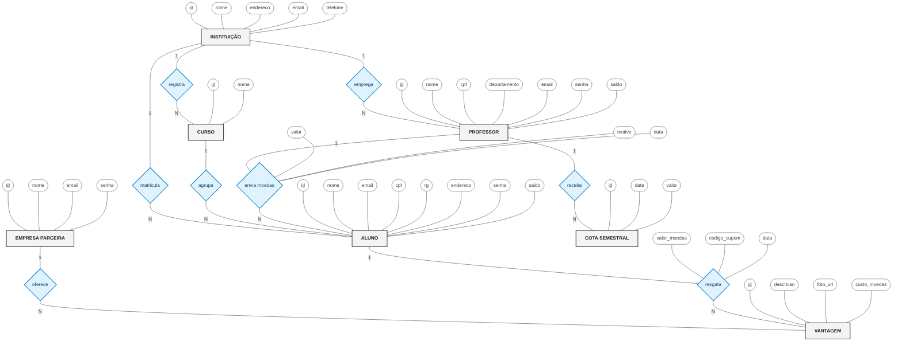

# Modelo ER - Notação de Peter Chen

A **Notação de Chen** é uma forma clássica e muito expressiva de modelar dados conceitualmente. Ao contrário da notação Pé-de-Galinha (Crow's Foot) que foca em tabelas, a notação de Chen foca na semântica real:
- **Entidades** são representadas por retângulos.
- **Relacionamentos** são representados por losangos.
- **Atributos** são representados por elipses (com os atributos identificadores/chaves primárias sublinhados).

Uma das belezas da Notação de Chen é permitir que **Relacionamentos tenham atributos**, o que se aplica perfeitamente às `TRANSAÇÕES` (envio de moedas) e aos `RESGATES` no nosso sistema.

Abaixo, utilizei a ferramenta Flowchart do Mermaid para simular as formas geométricas exatas da notação de Chen:

### Pontos de Destaque da Abordagem de Chen:
1. **Transações e Resgates não são Entidades aqui**: Em bancos relacionais, eles viram tabelas. Na modelagem conceitual de Chen, eles são a própria "ação" (o relacionamento *envia moedas* e *resgata*), que contém atributos de data, valor, etc.
2. **Cardinalidade (`1:N`) explícita**: Fica claro que uma *Instituição* possui múltiplos *Alunos*, mas um *Aluno* pertence a apenas uma *Instituição*.
3. **Identificadores**: Os campos que formam a Chave Primária (PK) estão sublinhados (`id`), como manda a notação oficial.
